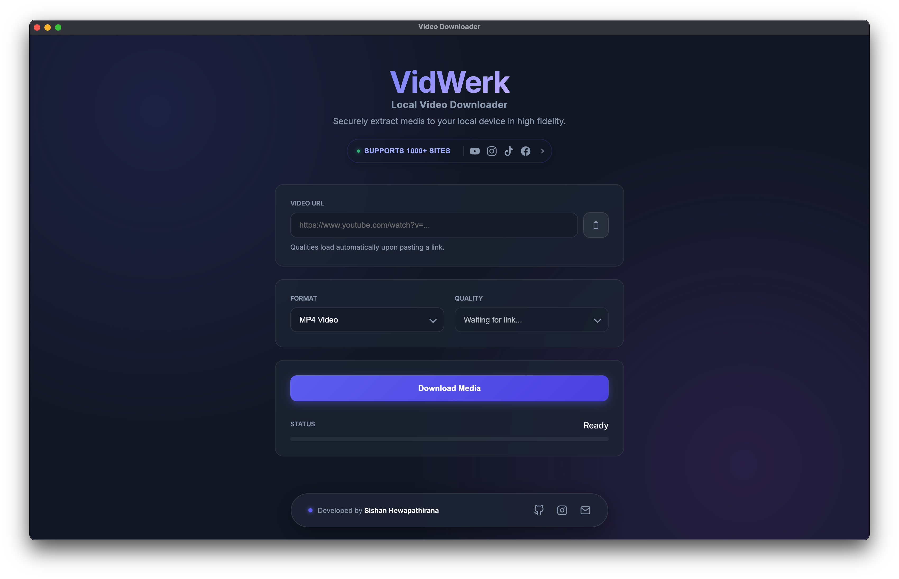

# 🎥 Local Video Downloader

A lightweight cross-platform desktop downloader built with **yt-dlp**.  
Download videos or audio from YouTube,Facebook,Instagram,Tiktok and **1000+ supported sites** — with clean quality options, progress tracking, and audio-merged MP4 output.

---

## 🖼️ Screenshot



> Replace `ui.png` with your real screenshot filename if different.

---

## ✅ Features

- **Desktop App UI (Electron)** — no browser required
- **MP4 + MP3 downloads**
- **Clean quality picker (1080p / 720p / 480p etc.)**
- **Auto-merge best audio into MP4** so every video has sound
- **Live progress** (percent / speed / ETA)
- **Cancel download anytime**
- **Duplicate downloads allowed** (auto-renames)
- **Show in folder after download**
- **Works fully offline after install**
- **Bundled yt-dlp + ffmpeg** (no extra installs)

---

## 📥 Download

Go to **Releases** and download the correct installer:

### macOS
- **Apple Silicon (M1/M2/M3):** `Local-Video-Downloader-2.0.0-arm64.dmg`
- **Intel Mac:** `Local-Video-Downloader-2.0.0-x64.dmg`

### Windows
- `Local-Video-Downloader-Setup-2.0.0.exe`

---

## 🍎 macOS First-Run Fix (Important)

Because the app bundles CLI binaries, macOS Gatekeeper may block it.

### Step 1 — Open anyway
1. Open the app once (it will warn)
2. Go to: **System Settings → Privacy & Security**
3. Scroll down and click **“Open Anyway”**
4. Re-open the app

### Step 2 — Allow yt-dlp binaries (if prompted)
If macOS blocks yt-dlp or ffmpeg:
1. Open them once from inside the app  
2. Repeat **Privacy & Security → Open Anyway**

---

## 🪟 Windows First-Run Note (SmartScreen)

Because the app isn’t code‑signed yet, Windows SmartScreen may block it on first run. Here’s how to bypass safely:

1. When the blue SmartScreen window appears, click **More info**.
2. Click **Run anyway**.
3. If Windows asks for permission (UAC prompt), click **Yes**.

### If you downloaded from GitHub and still see a block
Sometimes Windows marks files from the internet as “unsafe.” You can unblock it:

1. Right‑click the installer `.exe` → **Properties**.
2. At the bottom, check **Unblock**.
3. Click **Apply** → **OK**.
4. Run the installer again.

> Tip: Downloading from the official GitHub **Releases** page reduces false warnings.

---

## ⚙️ Development Setup (IntelliJ / Any IDE)

### 1. Clone repo
```bash
git clone https://github.com/sishanhewa/Local-Video-Downloader.git
cd Local-Video-Downloader
```

### 2. Install dependencies
```bash
npm install
```

### 3. Run in dev mode
```bash
npm run dev
```

---

## 📦 Build Installers

### macOS (Apple Silicon)
```bash
npm run dist:mac:arm
```

### macOS (Intel)
```bash
npm run dist:mac:intel
```

### Windows EXE
```bash
npm run dist:win
```

Installers will appear in:
```
dist/
```

---

## 📂 Folder Structure

```
Local-Video-Downloader/
├─ assets/              # icons (.png / .icns / .ico)
├─ bin/
│  ├─ mac/              # yt-dlp + ffmpeg mac binaries
│  └─ win/              # yt-dlp + ffmpeg windows binaries
├─ public/              # frontend UI
│  ├─ index.html
│  ├─ app.js
│  └─ styles.css
├─ server/
│  └─ api.js            # express + yt-dlp backend
├─ main.js              # electron main process
├─ package.json
└─ README.md
```

---

## 🛠 Troubleshooting

### No sound in MP4?
Not anymore — MP4 automatically merges best audio.  
If still an issue, confirm **ffmpeg.exe** exists in:

```
bin/win/ffmpeg.exe
```

### Formats missing size?
Some formats don’t report size.  
We estimate size using bitrate + duration, so you should still see sizes for most entries.

### Cancel leaves temp files?
Cancelled downloads may leave `.part` files occasionally.  
They are safe to delete manually — future versions will auto-clean them.

---

## 👨‍💻 Developed By

**Sishan Hewapathirana**

- GitHub: https://github.com/sishanhewa  
- Instagram: https://instagram.com/sishan.a  
- Email: sishanhewapathirana@gmail.com  

---

## ⭐ Support
If you like this project, give it a star ⭐  
Feature requests and PRs are welcome!
